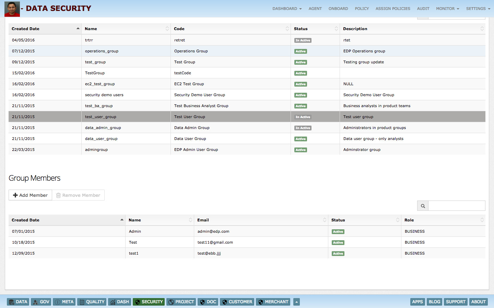

What is InsightLake Data Security?
-----------
Enterprises today are storing large amount of data in data lakes and data stores to gain insights. At the same time regulations like Sarbanes-Oxley, HIPAA, Basel III are forcing companies to protect sensitive data sets and conduct regular audits. Non compliance can lead to legal action, reputation damage and business loss.

This poses a big challenge for enterprises to manage data access security in a central and easy manner.

InsightLake Data Explorer solution is part of InsightLake Data Platform. It provides an intuitive UI and allows users to connect to various data sources and explore the data eaisly.

Insight Lake Security Manager solves this problem by allowing companies to manage security and monitoring of data assets (files, databases), which are present in cloud or on-premise centrally. It enables security administrators to define access policies easily with rich set of rules. It allows seamless migration by not requiring any change in existing applications and tools. It captures comprehensive audit logs to provide great detail about the access.

## Following are the main features provided by Security Manager:

* DCAP - Data Centric Audit & Protection
* Cloud and on-premise support
* Protection for many data assets relational DBs, File systems, Hadoop etc.
* Discover data assets continuously and identify gaps and sensitive information
* Monitor access rights regularly
* Monitor queries and alerting based on policies
* Protect data assets by modifying queries or blocking access
* Integration with metadata and governance policies
* Comprehensive audit logs
* Integration with external SEIMs like Splunk, LogRythm, InsightLake Cyber Security
* Integration with Sentry & Ranger

## Supported Data Assets - Cloud & On-Premise
Security Manager solution allows companies to monitor and protect variety of data assets. Following data areas are protected.

Database
Files
Big Data
SAS - Software-as-a-Service
IAAS - Infrastructure-as-a-Service

Hadoop Distributions - Cloudera (CDH), Hortonworks (HDP), MapR, EMR
Relational Databases - MySQL, Oracle, PostgreSQL
File System - S3, HDFS
Hadoop Data Store - Hive, Impala, SparkSQL, SOLR
MPP Databases - Redshift

## Central Policy Manager

Security Manger provides an interactive policy manager UI, which allows security admins to manage enterprise data assets from one place. They can explore data assets, monitor them, create policies, check audit logs and see dashboards.

## Applications and data domains
Security Manager integrates with Metadata and Governance solutions and provides insights through a hierarchy of business unit, application, data domain and user.

## Manage users

Security Manager allows companies to import or provision users manually. Users can be easily imported from AD systems. AD integration allows automatic policy handling for users who are removed from AD on their termination.

## Discover Sensitive Information
Security Manager solution provides asset discovery feature, which identifies what types of data stores present in a given network. Rich data profiling of data sets provides fine grain details about the sensitivity of data elements. Discovery feature allows creation of security policies for identified sensitive data elements like alerting, masking, blocking etc. Data discovery can be easily automated to provide continuous monitoring of sensitive elements.

## Monitor Access Rights
Security Manager allows security admins to monitor user access rights based on user roles. It allows them to identify if excess rights are given to a user whose role doesn't permit them. For example a developer is given drop table rights on production will be a security gap. Monitoring of access rights can be done periodically and alerts could be provisioned. From the interactive UI and dashboards security admins can monitor and explore access rights easily.

## Security Agents

Security agents are the main actors, they load policies from central policy server, monitor traffic, apply policies, generate alerts, modify queries for data protection and block access.

Security agents are divided in two types:

Monitoring Agent - These agents listen to the data access traffic in sniffing mode and apply policies to generate alerts and audit logs. They can't block the data connection or modify queries.
Proxy Agent - These agents sits in middle of the traffic, they apply policies to alert, generate audit logs, block access and modify queries.
Security Policies - Monitor & Protect
Enterprises can utilize rich set of policy rules to control access to data. Rules include: Coarse Grain Permissions - allow, deny Allow or deny data set joins Fine grain masking Data filtering Location Based Access Metadata Attributes

## Rich Rules

Enterprises can utilize rich set of policy rules to control access to data. Rules include:

Coarse Grain Permissions - allow, deny
Allow or deny data set joins
Fine grain masking
Data filtering
Location Based Access
Metadata Attributes
Comprehensive Audit
Security manager captures provides comprehensive audit of data assets as well operational policies. It provides :

Data access logs - captures details about user, data store, location, time, original query and modified queries by policies.
Policy changes logs - captures user, time and policy changes

Audit logs can be pushed to an enterprise based event handling systems or exported to big data based systems.

## Security Dashboards

Analyze and monitor all enterprise data assets using security dashboards

Following dashboards are provided:

Agents Dashboard
How agents are performing - number of connections, requests
Uptime
CPU, Memory
Access Rights Dashboard
Number of roles assigned, approved, rejected, in review
Dormant users
Users with direct access
Permissions distribution by users
Top users with more rights
User Access Dashboard
User requests
Top users
Access by location, time, IP, OS, Source, application, user group
AD Login/Logout
Top data stores with many access, users
Top data stores access which are most dormant
Queries Dashboard
Requests - hourly, weekday, weekly distributions
Top queries
Query type distributions
Sensitive queries - count, who queried, time, what db etc..
Number of records in response
Admin Dashboard
Type of admin queries - create, modify, drop etc
Sensitive queries - drop and truncate
Schema changes
Other governance activities

To learn more, check out [http://insightlake.com/dataexplorer.html](http://insightlake.com/dataexplorer.html)

Installation
------
* Download or clone the repository. 
* Run bin/insightlake command.
* Open browser with URL as http://localhost:8080/
* Change configuration in /conf folder to set different ports
* By default H2 database is used, you can change the database details in jdbc.properties file

License
------
InsightLake Data Explorer is a commercial product but distributed to be used freely. Please contact contact@insightlake.com for details.

Getting Help
----------

You can get help easily :
Community - Google Groups
Slack Channel
Twitter
Facebook
Email: contact@insightlake.com
